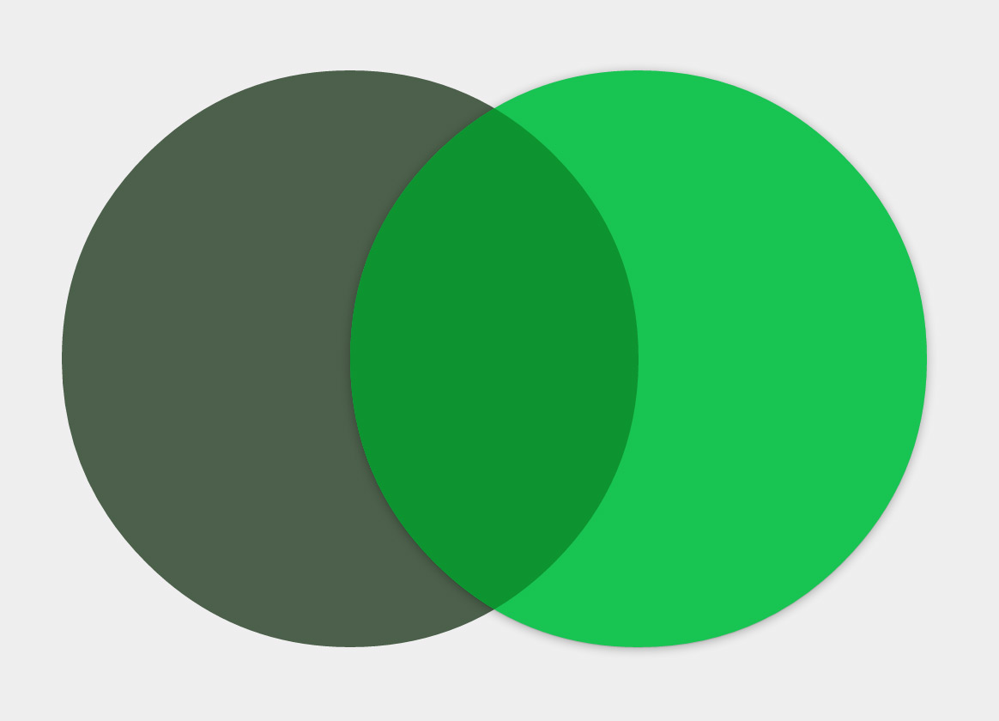

# [ColorBlendjs](http://javierbyte.github.io/colorblendjs/)

Javascript utility for blending colors.

[Live demo](http://javierbyte.github.io/colorblendjs/)

## Installation

    yarn install colorblendjs --save

## Usage

Require the file:

    var colorblend = require('colorblendjs');

Use it!

    // currently a color must be a `rgb` array like [160, 179, 197];
    // intensity goes from 0 to 1
    var resultColor = colorBlend.overlay(firstColor, secondColor, intensity);

